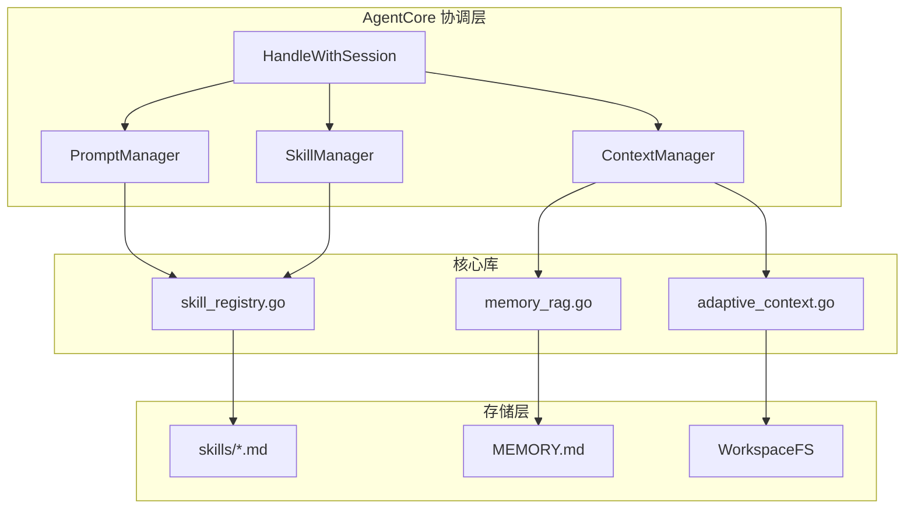

# Coral Agent 智能优化技术规范

## 架构总览



---

## 阶段1: 动态技能注册系统

### 目标
将硬编码的3个工具（workspace_read_file, workspace_write_file, memory_write_important）改为Markdown配置文件驱动，支持动态加载和热重载。

### 前置条件
- 现有 `src/tools.go` 中的 `defaultFilesystemTools()` 函数正常工作
- 现有 `src/agent_core.go` 中的 `AgentCore` 结构体可扩展
- `WorkspaceFS` 已实现文件读写能力

### 输入文件
- `src/tools.go` (L30-99) - 参考现有工具定义结构
- `src/agent_core.go` (L16-46) - 参考AgentCore初始化逻辑

### 具体步骤

#### 步骤1.1: 创建技能定义结构
**新建文件**: `src/skill.go`
```go
package main

import (
    "encoding/json"
    "sync"
)

// Skill 定义一个可动态加载的技能
type Skill struct {
    Name        string
    Description string                 // 包含使用场景和示例的完整描述
    Parameters  map[string]interface{} // JSON Schema格式
    Handler     SkillHandler           // 执行函数
    Examples    []SkillExample         // Few-shot示例
}

type SkillExample struct {
    Scenario string // 场景描述
    Request  string // 用户输入
    ToolCall string // 期望的工具调用JSON
}

type SkillHandler func(args json.RawMessage) (string, error)
```

#### 步骤1.2: 实现Markdown技能解析器
**新建文件**: `src/skill_parser_md.go`
```go
package main

import (
    "fmt"
    "os"
    "path/filepath"
    "regexp"
    "strings"
)

// MarkdownSkillParser 从Markdown文件解析技能定义
type MarkdownSkillParser struct{}

// Parse 解析单个.md技能文件
func (p *MarkdownSkillParser) Parse(filepath string) (*Skill, error) {
    content, err := os.ReadFile(filepath)
    if err != nil {
        return nil, err
    }
    
    text := string(content)
    
    skill := &Skill{
        Name:       extractH1(text),                    // 一级标题
        Description: extractDescription(text),          // Description章节 + Examples
        Parameters:  extractParameters(text),           // Parameters章节
        Examples:    extractExamples(text),             // Examples章节中的代码块
    }
    
    return skill, nil
}

// extractH1 提取一级标题 (# SkillName)
func extractH1(text string) string {
    re := regexp.MustCompile(`(?m)^#\s+(.+)$`)
    matches := re.FindStringSubmatch(text)
    if len(matches) > 1 {
        return strings.TrimSpace(matches[1])
    }
    return ""
}

// extractDescription 提取Description章节内容，包含使用场景
func extractDescription(text string) string {
    // 提取 ## Description 到下一个 ## 之间的内容
    re := regexp.MustCompile(`(?s)##\s*Description\s*\n(.*?)(?=\n##|$)`)
    matches := re.FindStringSubmatch(text)
    if len(matches) > 1 {
        desc := strings.TrimSpace(matches[1])
        
        // 附加Examples作为few-shot提示
        examples := extractExamples(text)
        if len(examples) > 0 {
            desc += "\n\n## Usage Examples\n"
            for i, ex := range examples {
                desc += fmt.Sprintf("\nExample %d: %s\n```json\n%s\n```\n", 
                    i+1, ex.Scenario, ex.ToolCall)
            }
        }
        return desc
    }
    return ""
}

// extractParameters 从Parameters章节提取JSON Schema
func extractParameters(text string) map[string]interface{} {
    // 匹配 ### paramName (required/optional) 格式
    params := map[string]interface{}{
        "type":       "object",
        "properties": map[string]interface{}{},
        "required":   []string{},
    }
    
    re := regexp.MustCompile(`(?m)###\s+(\w+)\s*\(([^)]+)\)(.*?)\n- \*\*类型\*\*:\s*(\w+)(.*?)\n- \*\*描述\*\*:\s*(.+?)(?=\n###|\n##|$)`)
    matches := re.FindAllStringSubmatch(text, -1)
    
    properties := params["properties"].(map[string]interface{})
    required := params["required"].([]string)
    
    for _, m := range matches {
        if len(m) >= 6 {
            name := strings.TrimSpace(m[1])
            requiredFlag := strings.TrimSpace(m[2])
            paramType := strings.TrimSpace(m[4])
            description := strings.TrimSpace(m[6])
            
            properties[name] = map[string]interface{}{
                "type":        paramType,
                "description": description,
            }
            
            if strings.Contains(requiredFlag, "required") {
                required = append(required, name)
            }
        }
    }
    
    params["required"] = required
    return params
}

// extractExamples 提取Examples章节中的JSON代码块
func extractExamples(text string) []SkillExample {
    var examples []SkillExample
    
    // 匹配 ### 示例X: 场景描述 后的json代码块
    re := regexp.MustCompile(`(?s)###\s*[^\n]*\n[^\n]*:\s*(.+?)\n\s*```json\s*\n(.+?)\n\s*````)
    matches := re.FindAllStringSubmatch(text, -1)
    
    for _, m := range matches {
        if len(m) >= 3 {
            examples = append(examples, SkillExample{
                Scenario: strings.TrimSpace(m[1]),
                ToolCall: strings.TrimSpace(m[2]),
            })
        }
    }
    
    return examples
}
```

#### 步骤1.3: 实现技能注册表
**新建文件**: `src/skill_registry.go`
```go
package main

import (
    "fmt"
    "os"
    "path/filepath"
    "strings"
    "sync"
)

// SkillRegistry 技能注册表，支持动态加载和热重载
type SkillRegistry struct {
    mu      sync.RWMutex
    skills  map[string]*Skill
    fs      *WorkspaceFS
    parser  *MarkdownSkillParser
    handlers map[string]SkillHandler // 内置handler映射
}

// NewSkillRegistry 创建注册表
func NewSkillRegistry(fs *WorkspaceFS) *SkillRegistry {
    return &SkillRegistry{
        skills:   make(map[string]*Skill),
        fs:       fs,
        parser:   &MarkdownSkillParser{},
        handlers: make(map[string]SkillHandler),
    }
}

// RegisterBuiltinHandlers 注册内置handler
func (r *SkillRegistry) RegisterBuiltinHandlers() {
    // 注册文件系统handler
    r.handlers["native:workspace_read_file"] = r.createReadFileHandler()
    r.handlers["native:workspace_write_file"] = r.createWriteFileHandler()
    r.handlers["native:memory_write_important"] = r.createMemoryWriteHandler()
}

// LoadFromDir 从目录加载所有.md技能定义
func (r *SkillRegistry) LoadFromDir(dir string) error {
    entries, err := os.ReadDir(dir)
    if err != nil {
        return fmt.Errorf("read skills dir %s: %w", dir, err)
    }
    
    for _, entry := range entries {
        if entry.IsDir() {
            // 递归加载子目录
            subDir := filepath.Join(dir, entry.Name())
            if err := r.LoadFromDir(subDir); err != nil {
                continue // 子目录错误不影响主流程
            }
            continue
        }
        
        if !strings.HasSuffix(entry.Name(), ".md") {
            continue
        }
        
        path := filepath.Join(dir, entry.Name())
        skill, err := r.parser.Parse(path)
        if err != nil {
            fmt.Printf("warn: parse skill %s failed: %v\n", path, err)
            continue
        }
        
        // 绑定handler
        handlerKey := r.extractHandlerKey(path, skill)
        if handler, ok := r.handlers[handlerKey]; ok {
            skill.Handler = handler
        } else {
            fmt.Printf("warn: no handler found for skill %s (key: %s)\n", skill.Name, handlerKey)
            continue
        }
        
        r.mu.Lock()
        r.skills[skill.Name] = skill
        r.mu.Unlock()
    }
    
    return nil
}

// extractHandlerKey 从文件路径或技能内容确定handler key
func (r *SkillRegistry) extractHandlerKey(path string, skill *Skill) string {
    // 从文件名推断，如 filesystem/read_file.md -> native:workspace_read_file
    base := filepath.Base(path)
    name := strings.TrimSuffix(base, ".md")
    
    // 根据目录结构推断命名空间
    dir := filepath.Dir(path)
    parts := strings.Split(dir, string(filepath.Separator))
    if len(parts) > 0 {
        namespace := parts[len(parts)-1]
        return fmt.Sprintf("native:%s_%s", namespace, name)
    }
    
    return "native:" + name
}

// Get 获取技能
func (r *SkillRegistry) Get(name string) (*Skill, bool) {
    r.mu.RLock()
    defer r.mu.RUnlock()
    skill, ok := r.skills[name]
    return skill, ok
}

// List 列出所有技能
func (r *SkillRegistry) List() []*Skill {
    r.mu.RLock()
    defer r.mu.RUnlock()
    
    list := make([]*Skill, 0, len(r.skills))
    for _, s := range r.skills {
        list = append(list, s)
    }
    return list
}

// ToTools 转换为Tool列表（兼容现有AgentCore）
func (r *SkillRegistry) ToTools() ([]Tool, map[string]SkillHandler) {
    r.mu.RLock()
    defer r.mu.RUnlock()
    
    tools := make([]Tool, 0, len(r.skills))
    handlers := make(map[string]SkillHandler)
    
    for name, skill := range r.skills {
        paramsJSON, _ := json.Marshal(skill.Parameters)
        tools = append(tools, Tool{
            Name:                 name,
            Description:          skill.Description,
            ParametersJSONSchema: string(paramsJSON),
        })
        handlers[name] = skill.Handler
    }
    
    return tools, handlers
}

// 内置handler实现
func (r *SkillRegistry) createReadFileHandler() SkillHandler {
    return func(args json.RawMessage) (string, error) {
        var payload struct {
            Path string `json:"path"`
        }
        if err := json.Unmarshal(args, &payload); err != nil {
            return "", fmt.Errorf("parse args failed: %w", err)
        }
        return r.fs.Read(payload.Path)
    }
}

func (r *SkillRegistry) createWriteFileHandler() SkillHandler {
    return func(args json.RawMessage) (string, error) {
        var payload struct {
            Path    string `json:"path"`
            Content string `json:"content"`
        }
        if err := json.Unmarshal(args, &payload); err != nil {
            return "", fmt.Errorf("parse args failed: %w", err)
        }
        return "写入成功", r.fs.Write(payload.Path, payload.Content)
    }
}

func (r *SkillRegistry) createMemoryWriteHandler() SkillHandler {
    return func(args json.RawMessage) (string, error) {
        var payload struct {
            Content string `json:"content"`
        }
        if err := json.Unmarshal(args, &payload); err != nil {
            return "", fmt.Errorf("parse args failed: %w", err)
        }
        // 使用原有memory_write_important逻辑
        return r.writeToMemory(payload.Content)
    }
}

func (r *SkillRegistry) writeToMemory(content string) (string, error) {
    now := Now()
    entry := fmt.Sprintf("\n\n## Memo at %s\n%s\n", now.Format(time.RFC3339), content)
    if err := r.fs.Append("MEMORY.md", entry); err != nil {
        return "", fmt.Errorf("write MEMORY.md failed: %w", err)
    }
    return "写入 MEMORY.md 成功", nil
}
```

#### 步骤1.4: 创建技能定义文件
**新建目录**: `skills/filesystem/`

**新建文件**: `skills/filesystem/read_file.md`
```markdown
# workspace_read_file

## Description
读取workspace目录下的相对路径文件内容。

**何时使用:**
- 用户要求查看、读取、打开某个文件
- 需要了解文件内容以回答问题
- 检查现有代码或配置文件

**何时不使用:**
- 文件路径是绝对路径（禁止访问workspace外文件）
- 路径包含".."（禁止目录遍历）

## Parameters

### path (required)
- **类型**: string
- **描述**: 要读取的相对路径，例如：AGENT.md、src/main.go。必须是workspace根目录下的相对路径，禁止绝对路径。

## Examples

### 示例1: 读取配置文件
用户说: "请查看AGENT.md文件内容"

```json
{
  "tool_calls": [{
    "type": "function",
    "function": {
      "name": "workspace_read_file",
      "arguments": {
        "path": "AGENT.md"
      }
    }
  }]
}
```

### 示例2: 读取代码文件
用户说: "帮我看看main.go里写了什么"

```json
{
  "tool_calls": [{
    "type": "function",
    "function": {
      "name": "workspace_read_file",
      "arguments": {
        "path": "src/main.go"
      }
    }
  }]
}
```

## Notes
- 如果文件不存在，会返回错误信息
- 大文件可能会被截断，请注意文件大小
```

**新建文件**: `skills/filesystem/write_file.md`
```markdown
# workspace_write_file

## Description
覆盖写入workspace目录下的相对路径文件内容。

**何时使用:**
- 用户要求创建新文件
- 用户要求修改现有文件内容
- 保存代码、配置或文档

**何时不使用:**
- 路径是绝对路径
- 路径包含".."试图逃逸workspace
- 用户没有明确授权修改文件

## Parameters

### path (required)
- **类型**: string
- **描述**: 要写入的相对路径，例如：NOTES.md、src/utils.go

### content (required)
- **类型**: string
- **描述**: 要写入文件的完整文本内容。如果是代码，确保格式正确。

## Examples

### 示例1: 创建笔记文件
用户说: "创建一个NOTES.md文件，内容是项目注意事项"

```json
{
  "tool_calls": [{
    "type": "function",
    "function": {
      "name": "workspace_write_file",
      "arguments": {
        "path": "NOTES.md",
        "content": "# 项目注意事项\n\n1. 使用Go 1.21+\n2. 遵循标准项目布局\n"
      }
    }
  }]
}
```

## Notes
- 会覆盖原有文件内容，请确认用户意图
- 写入后会返回"写入成功"确认
```

**新建目录**: `skills/memory/`

**新建文件**: `skills/memory/remember.md`
```markdown
# memory_write_important

## Description
将重要信息写入长期记忆文件(MEMORY.md)，用于跨会话保留关键信息。

**何时使用:**
- 用户明确要求"记住"、"记录"、"保存"某信息
- 用户表达长期偏好、原则或习惯（如"我喜欢..."、"我讨厌..."）
- 用户提供需要跨会话保留的配置信息（如API密钥、账号信息）
- 用户说"下次记得..."

**何时不使用:**
- 临时性的事实或当前任务的状态
- 会在本轮对话中立即使用的信息
- 一般性知识（如编程语法）
- 用户没有明确要求的普通对话内容

## Parameters

### content (required)
- **类型**: string
- **描述**: 要保存的完整信息内容。应该：
  - 包含足够的上下文，将来检索时能理解含义
  - 注明信息来源和时间
  - 如果是偏好，说明具体场景
  - 简洁明了，避免冗余

## Examples

### 示例1: 记录编码偏好
用户说: "请记住我喜欢用空格缩进，不要用tab"

```json
{
  "tool_calls": [{
    "type": "function",
    "function": {
      "name": "memory_write_important",
      "arguments": {
        "content": "用户编码偏好: 使用空格缩进(4个空格)，不使用tab字符。适用于所有编程语言。"
      }
    }
  }]
}
```

### 示例2: 记录API密钥
用户说: "我的OpenAI API密钥是sk-abc123，记住它"

```json
{
  "tool_calls": [{
    "type": "function",
    "function": {
      "name": "memory_write_important",
      "arguments": {
        "content": "OpenAI API密钥: sk-abc123 (由用户于2024-01-15提供，用于代码生成任务)"
      }
    }
  }]
}
```

### 示例3: 记录架构原则
用户说: "记住，我们项目从不使用第三方ORM，只用原生的database/sql"

```json
{
  "tool_calls": [{
    "type": "function",
    "function": {
      "name": "memory_write_important",
      "arguments": {
        "content": "项目架构原则: 禁止使用第三方ORM库，数据库操作必须使用Go标准库database/sql。技术负责人制定。"
      }
    }
  }]
}
```

### 示例4: 记录用户习惯
用户说: "我习惯先写测试再写实现"

```json
{
  "tool_calls": [{
    "type": "function",
    "function": {
      "name": "memory_write_important",
      "arguments": {
        "content": "用户开发习惯: TDD实践者，偏好先编写测试用例再实现功能代码。"
      }
    }
  }]
}
```

## Notes
- 写入MEMORY.md后，这些信息会在每次对话开始时自动加载到系统提示词中
- 如果记忆内容涉及敏感信息(如密钥)，应提醒用户注意安全风险
- 记忆内容会带有时间戳，便于后续管理
- 避免保存过于琐碎的信息，只保留长期有价值的内容
- 如果用户要求"忘记"某条记忆，目前需要手动编辑MEMORY.md文件
```

#### 步骤1.5: 修改AgentCore集成技能注册表
**修改文件**: `src/agent_core.go`

在 `AgentCore` 结构体中添加：
```go
type AgentCore struct {
    Client            *OpenAIClient
    FS                *WorkspaceFS
    Tools             []Tool
    Executors         map[string]ToolExecutor
    SystemContent     string
    UserProfile       string
    MaxContextTokens  int
    MaxOutputTokens   int
    SummaryWindowDays int
    
    // 新增: 技能注册表（如果启用）
    SkillRegistry     *SkillRegistry
}
```

在 `NewAgentCore` 函数中添加条件初始化：
```go
func NewAgentCore(client *OpenAIClient, systemContent, userProfile string, fs *WorkspaceFS, maxContextTokens, maxOutputTokens int) *AgentCore {
    agent := &AgentCore{
        Client:            client,
        FS:                fs,
        SystemContent:     systemContent,
        UserProfile:       userProfile,
        MaxContextTokens:  maxContextTokens,
        MaxOutputTokens:   maxOutputTokens,
        SummaryWindowDays: defaultSummaryWindowDays,
    }
    
    // 根据环境变量决定使用技能注册表还是硬编码工具
    if os.Getenv("CORAL_USE_SKILL_REGISTRY") == "true" && fs != nil {
        agent.SkillRegistry = NewSkillRegistry(fs)
        agent.SkillRegistry.RegisterBuiltinHandlers()
        
        // 加载skills目录
        skillsDir := filepath.Join(fs.Root, "skills")
        if _, err := os.Stat(skillsDir); err == nil {
            if err := agent.SkillRegistry.LoadFromDir(skillsDir); err != nil {
                log.Printf("warn: load skills failed: %v, fallback to default tools", err)
                agent.loadDefaultTools(fs)
            } else {
                agent.Tools, agent.Executors = agent.SkillRegistry.ToTools()
            }
        } else {
            agent.loadDefaultTools(fs)
        }
    } else {
        agent.loadDefaultTools(fs)
    }
    
    return agent
}

// loadDefaultTools 加载原有硬编码工具（回退方案）
func (a *AgentCore) loadDefaultTools(fs *WorkspaceFS) {
    if fs != nil {
        a.Tools, a.Executors = defaultFilesystemTools(fs)
    }
}
```

#### 步骤1.6: 删除硬编码工具逻辑（可选保留）
**修改文件**: `src/tools.go`

保留 `defaultFilesystemTools` 函数作为回退方案，但不再作为默认路径：
```go
// defaultFilesystemTools 保留作为fallback，当技能注册表不可用时使用
// 注意: 当CORAL_USE_SKILL_REGISTRY=true时，此函数不会被调用
func defaultFilesystemTools(fs *WorkspaceFS) ([]Tool, map[string]ToolExecutor) {
    // 原有实现保持不变
}
```

### 输出文件
- `src/skill.go` - 技能定义结构
- `src/skill_parser_md.go` - Markdown技能解析器
- `src/skill_registry.go` - 技能注册表
- `skills/filesystem/read_file.md` - 文件读取技能定义
- `skills/filesystem/write_file.md` - 文件写入技能定义
- `skills/memory/remember.md` - 记忆写入技能定义
- 修改后的 `src/agent_core.go` - 集成技能注册表

### 验证标准
1. 启动时自动扫描 `skills/` 目录加载所有 `.md` 技能文件
2. `SkillRegistry.List()` 返回的技能列表包含所有已加载技能
3. 技能描述包含完整的Examples作为few-shot提示
4. 设置 `CORAL_USE_SKILL_REGISTRY=false` 时回退到原有硬编码工具
5. 单元测试：解析器能正确提取所有字段
6. 集成测试：Agent能正常使用技能注册表加载的工具

---

## 阶段2: Prompt-First工具引导

### 目标
用系统提示词引导模型自主决策工具调用，替代代码层面的 `shouldForceMemoryTool` 强制逻辑。

### 前置条件
- 阶段1已完成，技能注册表可正常工作
- `src/agent_core.go` 的 `HandleWithSessionWithMedia` 方法可修改

### 输入文件
- `src/tools.go` (L133-160) - 参考 `shouldForceMemoryTool` 实现
- `src/agent_core.go` (L82-237) - 参考HandleWithSessionWithMedia实现
- `src/prompts.go` - 参考现有prompt结构

### 具体步骤

#### 步骤2.1: 创建Prompt管理器
**新建文件**: `src/prompt_manager.go`
```go
package main

import (
    "fmt"
    "strings"
)

// PromptManager 动态组装system prompt
type PromptManager struct {
    basePrompt string
}

// NewPromptManager 创建Prompt管理器
func NewPromptManager(basePrompt string) *PromptManager {
    return &PromptManager{
        basePrompt: basePrompt,
    }
}

// BuildSystemPrompt 构建完整的system prompt
func (pm *PromptManager) BuildSystemPrompt(tools []Tool, memory string) string {
    var b strings.Builder
    
    // 基础系统提示
    b.WriteString(pm.basePrompt)
    b.WriteString("\n\n")
    
    // 可用工具列表（包含详细描述和示例）
    b.WriteString("## Available Tools\n")
    b.WriteString("You have access to the following tools. Use them when appropriate based on their descriptions.\n\n")
    
    for _, tool := range tools {
        b.WriteString(fmt.Sprintf("### %s\n", tool.Name))
        b.WriteString(tool.Description)
        b.WriteString("\n\n")
    }
    
    b.WriteString("When you need to use a tool, respond with a tool_calls block.\n")
    b.WriteString("When you receive tool results, incorporate them into your final response.\n\n")
    
    // 长期记忆（如果有）
    if memory != "" {
        b.WriteString("## Long-term Memory\n")
        b.WriteString("The following information has been remembered from previous conversations:\n")
        b.WriteString(memory)
        b.WriteString("\n\n")
    }
    
    b.WriteString("## Guidelines\n")
    b.WriteString("- Use tools proactively when the user's request clearly matches a tool's purpose\n")
    b.WriteString("- Do not ask permission to use tools, just use them when appropriate\n")
    b.WriteString("- Always provide helpful responses based on tool results\n")
    
    return b.String()
}

// ExtractToolDescriptions 从skills提取工具描述（包含Examples）
func (pm *PromptManager) ExtractToolDescriptions(registry *SkillRegistry) []Tool {
    if registry == nil {
        return nil
    }
    
    tools, _ := registry.ToTools()
    return tools
}
```

#### 步骤2.2: 重构prompts.go
**修改文件**: `src/prompts.go`

将原有硬编码prompt改为模板化基础prompt：
```go
package main

// defaultAgentBase 是基础系统提示模板（不含工具描述）
const defaultAgentBase = `# System
You are Coral, a command-line AI agent powered by Go and OpenAI-compatible models.

Your capabilities:
- Read and write files in the workspace directory
- Remember important information across conversations
- Execute tasks using available tools

## Rules
1. Always use relative paths within the workspace (e.g., "AGENT.md", "src/main.go")
2. Never use absolute paths or ".." to escape the workspace
3. Provide clear, helpful responses
4. {{TOOL_USAGE_INSTRUCTION}}

## Communication
- Input: User queries in natural language
- Output: Text responses, optionally with tool_calls for actions`

// defaultUser 用户档案模板
const defaultUser = `# User Profile
- Name: {{USER_NAME}}
- Timezone: {{TIMEZONE}}
- Country: {{COUNTRY}}
- Language: {{LANGUAGE}}`

// defaultMemory 记忆文件头部模板
const defaultMemory = `# Long-term Memory
This file contains information remembered across sessions.
Do not edit manually unless necessary.`
```

#### 步骤2.3: 修改AgentCore移除强制逻辑
**修改文件**: `src/agent_core.go`

在 `HandleWithSessionWithMedia` 中：

删除或注释掉原有的强制逻辑：
```go
// 删除以下代码:
// forceKey := rawText
// if forceKey == "" {
//     forceKey = modelUserText
// }
// forceMemory := shouldForceMemoryTool(forceKey)  // 删除此行
```

改为纯auto模式：
```go
// 工具选择策略：完全由模型自主决定
toolChoice := "auto"
forceFunction := ""

// 可选：高置信度意图检测（如果启用了阶段5）
if agent.IntentDetector != nil {
    intent, confidence := agent.IntentDetector.Detect(rawText)
    if confidence > 0.85 {
        toolChoice = "required"
        forceFunction = intent.Action
    }
}
```

集成PromptManager：
```go
// 在HandleWithSessionWithMedia开始处
func (a *AgentCore) HandleWithSessionWithMedia(sessionID string, userInput string, images []UserImage) (string, error) {
    // ... 前置处理 ...
    
    // 使用PromptManager构建动态system prompt
    var systemContent string
    if a.PromptManager != nil && a.SkillRegistry != nil {
        // 获取记忆内容
        memoryContent := a.loadMemoryContent()
        tools, _ := a.SkillRegistry.ToTools()
        systemContent = a.PromptManager.BuildSystemPrompt(tools, memoryContent)
    } else {
        // 回退到原有固定system prompt
        systemContent = a.SystemContent
    }
    
    // ... 后续处理 ...
}

// loadMemoryContent 加载MEMORY.md内容
func (a *AgentCore) loadMemoryContent() string {
    if a.FS == nil {
        return ""
    }
    content, err := a.FS.Read("MEMORY.md")
    if err != nil {
        return ""
    }
    return content
}
```

#### 步骤2.4: 删除shouldForceMemoryTool
**修改文件**: `src/tools.go`

删除或标记为废弃的 `shouldForceMemoryTool` 函数：
```go
// shouldForceMemoryTool 已废弃，保留仅供回退使用
// 当CORAL_USE_PROMPT_FIRST=true时，此函数不会被调用
// 工具调用决策由模型通过system prompt自主完成
// Deprecated: Use prompt-based tool guidance instead
func shouldForceMemoryTool(userInput string) bool {
    // 原有实现保持不变，但不再被新代码调用
    // ...
}
```

### 输出文件
- `src/prompt_manager.go` - Prompt管理器
- 修改后的 `src/prompts.go` - 模板化基础prompt
- 修改后的 `src/agent_core.go` - 移除强制逻辑，集成PromptManager
- 修改后的 `src/tools.go` - 标记shouldForceMemoryTool为废弃

### 验证标准
1. 删除 `shouldForceMemoryTool` 调用后，模型仍能通过prompt引导正确使用工具
2. System prompt包含完整的工具描述和使用示例
3. 工具调用准确率不下降（对比测试）
4. 设置 `CORAL_USE_PROMPT_FIRST=false` 时回退到原有强制逻辑

---

## 阶段3: RAG记忆系统

### 目标
实现基于BM25语义相似度的记忆检索，替代固定加载整个MEMORY.md。

### 前置条件
- `WorkspaceFS` 能正常读写文件
- 阶段2的PromptManager能动态注入记忆内容

### 输入文件
- `src/session.go` - 参考现有记忆加载逻辑
- `src/tokens.go` - 参考SimpleMsg结构

### 具体步骤

#### 步骤3.1: 创建RAG记忆系统
**新建文件**: `src/memory_rag.go`
```go
package main

import (
    "crypto/sha256"
    "encoding/json"
    "fmt"
    "math"
    "sort"
    "strings"
    "time"
)

// MemoryEntry 单个记忆条目
type MemoryEntry struct {
    ID          string    `json:"id"`
    Content     string    `json:"content"`
    Timestamp   time.Time `json:"timestamp"`
    Importance  float64   `json:"importance"` // 0-1
    Tags        []string  `json:"tags"`
    Embedding   []float32 `json:"-"` // 内存中的特征向量，不持久化
}

// RAGMemory 基于语义的检索增强记忆系统
type RAGMemory struct {
    FS       *WorkspaceFS
    entries  []MemoryEntry
    features map[string][]float32 // ID -> 特征向量缓存
}

// NewRAGMemory 创建RAG记忆系统
func NewRAGMemory(fs *WorkspaceFS) *RAGMemory {
    return &RAGMemory{
        FS:       fs,
        features: make(map[string][]float32),
    }
}

// Load 从MEMORY.md加载所有记忆条目
func (m *RAGMemory) Load() error {
    content, err := m.FS.Read("MEMORY.md")
    if err != nil {
        // 文件不存在时返回空列表
        m.entries = []MemoryEntry{}
        return nil
    }
    
    m.entries = parseMemoryEntries(content)
    
    // 预计算所有条目的特征向量
    for i := range m.entries {
        m.entries[i].Embedding = m.bm25Features(m.entries[i].Content)
        m.features[m.entries[i].ID] = m.entries[i].Embedding
    }
    
    return nil
}

// Retrieve 检索与查询最相关的topK条记忆
func (m *RAGMemory) Retrieve(query string, topK int) []MemoryEntry {
    if len(m.entries) == 0 {
        return nil
    }
    
    queryVec := m.bm25Features(query)
    
    // 计算相似度并排序
    type scoredEntry struct {
        entry MemoryEntry
        score float64
    }
    
    scored := make([]scoredEntry, len(m.entries))
    for i, e := range m.entries {
        var score float64
        if e.Embedding != nil {
            score = cosineSimilarity(queryVec, e.Embedding)
        } else {
            // 如果embedding未计算，实时计算
            entryVec := m.bm25Features(e.Content)
            score = cosineSimilarity(queryVec, entryVec)
        }
        scored[i] = scoredEntry{entry: e, score: score}
    }
    
    // 按相似度降序排序
    sort.Slice(scored, func(i, j int) bool {
        return scored[i].score > scored[j].score
    })
    
    // 返回topK，过滤低相似度的（<0.3）
    result := make([]MemoryEntry, 0, topK)
    for i := 0; i < len(scored) && len(result) < topK; i++ {
        if scored[i].score > 0.3 {
            result = append(result, scored[i].entry)
        }
    }
    
    return result
}

// bm25Features 提取BM25特征向量（零外部依赖）
func (m *RAGMemory) bm25Features(text string) []float32 {
    terms := tokenize(text)
    
    // 使用1000维的稀疏向量（哈希桶）
    features := make([]float32, 1000)
    
    // 词频统计
    termFreq := make(map[string]int)
    for _, term := range terms {
        termFreq[term]++
    }
    
    // 计算TF-IDF风格的权重，哈希到固定维度
    for term, freq := range termFreq {
        // 简单TF（可改进为BM25公式）
        tf := float32(math.Log1p(float64(freq)))
        
        // 哈希到桶
        hash := sha256.Sum256([]byte(term))
        bucket := int(hash[0]) % 1000
        
        features[bucket] += tf
    }
    
    // L2归一化
    return normalizeVector(features)
}

// tokenize 简单分词
func tokenize(text string) []string {
    // 转小写，移除非字母数字
    text = strings.ToLower(text)
    var tokens []string
    
    // 按非字母数字字符分割
    fields := strings.FieldsFunc(text, func(r rune) bool {
        return !(r >= 'a' && r <= 'z') && !(r >= '0' && r <= '9') && r < 128
    })
    
    // 过滤停用词和短词
    stopWords := map[string]bool{
        "the": true, "a": true, "an": true, "is": true, "are": true,
        "was": true, "were": true, "be": true, "been": true, "being": true,
        "的": true, "是": true, "在": true, "和": true, "了": true,
    }
    
    for _, f := range fields {
        if len(f) > 2 && !stopWords[f] {
            tokens = append(tokens, f)
        }
    }
    
    return tokens
}

// cosineSimilarity 计算余弦相似度
func cosineSimilarity(a, b []float32) float64 {
    if len(a) != len(b) {
        return 0
    }
    
    var dotProduct float64
    var normA float64
    var normB float64
    
    for i := range a {
        dotProduct += float64(a[i] * b[i])
        normA += float64(a[i] * a[i])
        normB += float64(b[i] * b[i])
    }
    
    if normA == 0 || normB == 0 {
        return 0
    }
    
    return dotProduct / (math.Sqrt(normA) * math.Sqrt(normB))
}

// normalizeVector L2归一化
func normalizeVector(v []float32) []float32 {
    var norm float64
    for _, x := range v {
        norm += float64(x * x)
    }
    
    if norm == 0 {
        return v
    }
    
    norm = math.Sqrt(norm)
    result := make([]float32, len(v))
    for i, x := range v {
        result[i] = float32(float64(x) / norm)
    }
    
    return result
}

// parseMemoryEntries 解析MEMORY.md内容为条目列表
func parseMemoryEntries(content string) []MemoryEntry {
    var entries []MemoryEntry
    
    // 按 "## Memo at" 分割
    parts := strings.Split(content, "## Memo at")
    
    for _, part := range parts[1:] { // 跳过第一部分（通常是头部说明）
        part = strings.TrimSpace(part)
        if part == "" {
            continue
        }
        
        // 解析时间戳和内容
        lines := strings.SplitN(part, "\n", 2)
        if len(lines) < 2 {
            continue
        }
        
        timestampStr := strings.TrimSpace(lines[0])
        content := strings.TrimSpace(lines[1])
        
        ts, err := time.Parse(time.RFC3339, timestampStr)
        if err != nil {
            ts = time.Now()
        }
        
        // 生成ID
        hash := sha256.Sum256([]byte(content))
        id := fmt.Sprintf("%x", hash[:8])
        
        entries = append(entries, MemoryEntry{
            ID:        id,
            Content:   content,
            Timestamp: ts,
            Importance: 0.5, // 默认重要性
        })
    }
    
    return entries
}

// AddEntry 添加新记忆条目
func (m *RAGMemory) AddEntry(content string) error {
    // 生成ID
    hash := sha256.Sum256([]byte(content))
    id := fmt.Sprintf("%x", hash[:8])
    
    entry := MemoryEntry{
        ID:         id,
        Content:    content,
        Timestamp:  time.Now(),
        Importance: 0.5,
        Embedding:  m.bm25Features(content),
    }
    
    m.entries = append(m.entries, entry)
    m.features[id] = entry.Embedding
    
    return nil
}
```

#### 步骤3.2: 修改AgentCore集成RAG
**修改文件**: `src/agent_core.go`

在AgentCore结构体中添加：
```go
type AgentCore struct {
    // ... 原有字段 ...
    
    // 新增: RAG记忆系统
    RAGMemory *RAGMemory
}
```

在NewAgentCore中添加条件初始化：
```go
// 初始化RAG记忆系统
if os.Getenv("CORAL_USE_RAG_MEMORY") == "true" && fs != nil {
    agent.RAGMemory = NewRAGMemory(fs)
    if err := agent.RAGMemory.Load(); err != nil {
        log.Printf("warn: load RAG memory failed: %v", err)
    }
}
```

#### 步骤3.3: 修改PromptManager支持动态记忆
**修改文件**: `src/prompt_manager.go`

更新BuildSystemPrompt支持检索到的记忆：
```go
// BuildSystemPromptWithRAG 使用RAG检索相关记忆
func (pm *PromptManager) BuildSystemPromptWithRAG(
    tools []Tool, 
    ragMemory *RAGMemory, 
    query string,
) string {
    
    var memoryContent string
    if ragMemory != nil {
        // 检索与当前查询相关的记忆
        relevantMemories := ragMemory.Retrieve(query, 5)
        if len(relevantMemories) > 0 {
            var parts []string
            for _, m := range relevantMemories {
                parts = append(parts, fmt.Sprintf("- %s", m.Content))
            }
            memoryContent = strings.Join(parts, "\n")
        }
    }
    
    return pm.BuildSystemPrompt(tools, memoryContent)
}
```

### 输出文件
- `src/memory_rag.go` - RAG记忆系统实现
- 修改后的 `src/agent_core.go` - 集成RAGMemory
- 修改后的 `src/prompt_manager.go` - 支持动态记忆注入

### 验证标准
1. BM25特征提取正确，相似度计算合理
2. 检索结果按相关性排序
3. 与当前查询相关的记忆被正确注入prompt
4. 无关记忆不干扰当前对话
5. 设置 `CORAL_USE_RAG_MEMORY=false` 时回退到加载整个MEMORY.md

---

## 阶段4: 自适应上下文压缩

### 目标
基于语义相关性智能压缩历史对话，保留相关部分，摘要无关部分。

### 前置条件
- 阶段3的RAGMemory已实现bm25Features
- `src/context_trim.go` 和 `src/tokens.go` 存在现有裁剪逻辑

### 输入文件
- `src/context_trim.go` - 参考现有裁剪实现
- `src/tokens.go` - 参考reduceHistory函数

### 具体步骤

#### 步骤4.1: 创建自适应上下文管理器
**新建文件**: `src/adaptive_context.go`
```go
package main

import (
    "fmt"
    "strings"
    
    openai "github.com/openai/openai-go/v3"
)

// AdaptiveContextManager 基于相关性智能管理上下文
type AdaptiveContextManager struct {
    MaxTokens int
    RAGMemory *RAGMemory // 使用其bm25Features方法
}

// NewAdaptiveContextManager 创建自适应上下文管理器
func NewAdaptiveContextManager(maxTokens int, rag *RAGMemory) *AdaptiveContextManager {
    return &AdaptiveContextManager{
        MaxTokens: maxTokens,
        RAGMemory: rag,
    }
}

// BuildMessages 构建消息列表，智能压缩历史
func (acm *AdaptiveContextManager) BuildMessages(
    systemPrompt string,
    userInput string,
    history []ChatMessage,
) []openai.ChatCompletionMessageParamUnion {
    
    // 1. 检索相关记忆
    var memoryContext string
    if acm.RAGMemory != nil {
        memories := acm.RAGMemory.Retrieve(userInput, 3)
        if len(memories) > 0 {
            var parts []string
            for _, m := range memories {
                parts = append(parts, m.Content)
            }
            memoryContext = "相关记忆:\n" + strings.Join(parts, "\n")
        }
    }
    
    // 2. 构建完整的消息列表（还未裁剪）
    var msgs []openai.ChatCompletionMessageParamUnion
    
    // System prompt（包含相关记忆）
    fullSystem := systemPrompt
    if memoryContext != "" {
        fullSystem += "\n\n" + memoryContext
    }
    msgs = append(msgs, openai.SystemMessage(fullSystem))
    
    // 3. 处理历史消息
    processedHistory := acm.processHistory(history, userInput)
    for _, h := range processedHistory {
        msgs = append(msgs, chatMessageToParam(h))
    }
    
    // 4. 当前用户输入
    msgs = append(msgs, openai.UserMessage(userInput))
    
    // 5. 应用token限制（必要时智能裁剪）
    return acm.applyTokenLimit(msgs)
}

// processHistory 处理历史消息，按相关性分类
func (acm *AdaptiveContextManager) processHistory(
    history []ChatMessage, 
    currentInput string,
) []ChatMessage {
    if len(history) == 0 {
        return nil
    }
    
    // 保留最近的N条完整记录（通常是5-10轮）
    recentCount := 5
    if len(history) <= recentCount {
        return history
    }
    
    recent := history[len(history)-recentCount:]
    older := history[:len(history)-recentCount]
    
    // 计算查询向量
    queryVec := acm.RAGMemory.bm25Features(currentInput)
    
    // 对历史消息按相关性分类
    var relevant, other []ChatMessage
    for _, msg := range older {
        msgVec := acm.RAGMemory.bm25Features(msg.Content)
        similarity := cosineSimilarity(queryVec, msgVec)
        
        if similarity > 0.5 {
            relevant = append(relevant, msg)
        } else {
            other = append(other, msg)
        }
    }
    
    // 构建处理后的历史
    var result []ChatMessage
    
    // 相关历史保留完整（但限制数量）
    if len(relevant) > 10 {
        relevant = relevant[len(relevant)-10:]
    }
    result = append(result, relevant...)
    
    // 无关历史生成摘要
    if len(other) > 0 {
        summary := acm.summarizeMessages(other)
        result = append(result, ChatMessage{
            Role:    "system",
            Content: fmt.Sprintf("[前文摘要] %s", summary),
        })
    }
    
    // 添加最近完整记录
    result = append(result, recent...)
    
    return result
}

// summarizeMessages 摘要一批消息
func (acm *AdaptiveContextManager) summarizeMessages(msgs []ChatMessage) string {
    if len(msgs) == 0 {
        return ""
    }
    
    // 简单规则：提取每个user消息的前50字作为要点
    var points []string
    for _, m := range msgs {
        if m.Role == "user" {
            content := m.Content
            if len([]rune(content)) > 50 {
                content = string([]rune(content)[:50]) + "..."
            }
            points = append(points, fmt.Sprintf("问: %s", content))
        }
    }
    
    if len(points) == 0 {
        return fmt.Sprintf("(%d条历史消息)", len(msgs))
    }
    
    return strings.Join(points, "; ")
}

// applyTokenLimit 应用token限制，必要时截断
func (acm *AdaptiveContextManager) applyTokenLimit(
    msgs []openai.ChatCompletionMessageParamUnion,
) []openai.ChatCompletionMessageParamUnion {
    if acm.MaxTokens <= 0 {
        return msgs
    }
    
    // 转换为SimpleMsg进行估算
    simpleMsgs := paramsToSimpleMsgs(msgs)
    
    // 如果未超限，直接返回
    if estimateTokensSimple(simpleMsgs) <= acm.MaxTokens {
        return msgs
    }
    
    // 超限时，保留system和最近的消息，截断中间部分
    if len(msgs) <= 2 {
        return msgs // 太少无法裁剪
    }
    
    // 保留system（第1条）和最近2条
    head := msgs[0:1]
    tail := msgs[len(msgs)-2:]
    
    // 中间部分用一个摘要消息代替
    middleCount := len(msgs) - 3
    summary := openai.SystemMessage(
        fmt.Sprintf("(中间%d条消息因长度限制已省略)", middleCount),
    )
    
    result := append(head, summary)
    result = append(result, tail...)
    
    return result
}

// 辅助函数
func chatMessageToParam(msg ChatMessage) openai.ChatCompletionMessageParamUnion {
    switch msg.Role {
    case "system":
        return openai.SystemMessage(msg.Content)
    case "assistant":
        return openai.AssistantMessage(msg.Content)
    case "user":
        return openai.UserMessage(msg.Content)
    default:
        return openai.UserMessage(msg.Content)
    }
}

func paramsToSimpleMsgs(msgs []openai.ChatCompletionMessageParamUnion) []SimpleMsg {
    // 转换为SimpleMsg进行token估算
    var result []SimpleMsg
    for _, m := range msgs {
        // 根据实际类型提取content
        // ... 省略具体实现
        result = append(result, SimpleMsg{
            Role:    classifyChatMessageRole(m),
            Content: extractContent(m),
        })
    }
    return result
}
```

#### 步骤4.2: 修改AgentCore使用自适应上下文
**修改文件**: `src/agent_core.go`

在HandleWithSessionWithMedia中使用AdaptiveContextManager：
```go
func (a *AgentCore) HandleWithSessionWithMedia(sessionID string, userInput string, images []UserImage) (string, error) {
    // ... 前置处理 ...
    
    var messages []openai.ChatCompletionMessageParamUnion
    
    if os.Getenv("CORAL_USE_ADAPTIVE_CONTEXT") == "true" && a.RAGMemory != nil {
        // 使用自适应上下文管理器
        acm := NewAdaptiveContextManager(a.MaxContextTokens, a.RAGMemory)
        
        // 构建系统prompt（包含动态记忆）
        systemPrompt := a.PromptManager.BuildSystemPrompt(a.Tools, "")
        
        // 加载历史
        history := a.loadSessionHistory(sessionID)
        
        // 构建自适应消息列表
        messages = acm.BuildMessages(systemPrompt, userInput, history)
    } else {
        // 回退到原有逻辑
        messages = a.buildMessagesLegacy(sessionID, userInput, images)
    }
    
    // ... 后续处理 ...
}
```

### 输出文件
- `src/adaptive_context.go` - 自适应上下文管理器
- 修改后的 `src/agent_core.go` - 集成自适应上下文

### 验证标准
1. 历史消息按相关性正确分类
2. 相关历史保留完整，无关历史被摘要
3. Token限制被正确应用
4. 长对话场景下连贯性不下降
5. 设置 `CORAL_USE_ADAPTIVE_CONTEXT=false` 时回退到原有裁剪逻辑

---

## 阶段5: 意图检测（可选）

### 目标
为需要强制工具调用的场景提供轻量级语义意图检测。

### 前置条件
- 阶段1的技能注册表可提供工具列表
- 可选功能，不影响核心流程

### 输入文件
- 无特定输入，依赖已有技能定义

### 具体步骤

#### 步骤5.1: 实现意图检测器
**新建文件**: `src/intent_detector.go`
```go
package main

import (
    "strings"
)

// Intent 检测到的意图
type Intent struct {
    Type       string  // 技能名
    Action     string  // 同上
    Confidence float64 // 置信度 0-1
}

// IntentDetector 轻量级意图检测器
type IntentDetector struct {
    tools []Tool
}

// NewIntentDetector 创建意图检测器
func NewIntentDetector(tools []Tool) *IntentDetector {
    return &IntentDetector{tools: tools}
}

// Detect 检测用户输入意图
func (d *IntentDetector) Detect(input string) (Intent, float64) {
    inputLower := strings.ToLower(input)
    inputWords := tokenize(inputLower)
    
    if len(inputWords) == 0 {
        return Intent{}, 0
    }
    
    var bestMatch struct {
        toolName string
        score    float64
    }
    
    for _, tool := range d.tools {
        score := d.calculateScore(inputWords, tool)
        if score > bestMatch.score {
            bestMatch.score = score
            bestMatch.toolName = tool.Name
        }
    }
    
    return Intent{
        Type:   bestMatch.toolName,
        Action: bestMatch.toolName,
    }, bestMatch.score
}

// calculateScore 计算输入与工具的匹配分数
func (d *IntentDetector) calculateScore(inputWords []string, tool Tool) float64 {
    // 提取工具描述中的关键词
    descLower := strings.ToLower(tool.Description)
    descWords := tokenize(descLower)
    
    // 计算重叠
    overlap := 0
    for _, iw := range inputWords {
        for _, dw := range descWords {
            if iw == dw || strings.Contains(dw, iw) || strings.Contains(iw, dw) {
                overlap++
                break
            }
        }
    }
    
    // 基础分数：重叠词比例
    score := float64(overlap) / float64(len(inputWords))
    
    // 加分项：工具名匹配
    toolNameLower := strings.ToLower(tool.Name)
    for _, word := range inputWords {
        if strings.Contains(toolNameLower, word) {
            score += 0.2
            break
        }
    }
    
    // 加分项：关键词匹配（从Description提取的强指示词）
    keywords := extractKeywords(tool.Description)
    for _, kw := range keywords {
        for _, word := range inputWords {
            if word == kw || strings.Contains(word, kw) {
                score += 0.3
                break
            }
        }
    }
    
    if score > 1.0 {
        score = 1.0
    }
    
    return score
}

// extractKeywords 从描述提取强指示关键词
func extractKeywords(description string) []string {
    // 简单实现：返回描述中可能的关键词
    // 可扩展为使用NLP或预定义关键词表
    var keywords []string
    
    // 基于技能类型的常见关键词
    if strings.Contains(description, "memory") || strings.Contains(description, "remember") {
        keywords = append(keywords, "记住", "记录", "保存", "memory", "remember", "note")
    }
    if strings.Contains(description, "read") || strings.Contains(description, "file") {
        keywords = append(keywords, "读取", "查看", "打开", "read", "view", "open", "文件")
    }
    if strings.Contains(description, "write") {
        keywords = append(keywords, "写入", "修改", "保存", "write", "edit", "save")
    }
    
    return keywords
}
```

#### 步骤5.2: 修改AgentCore集成意图检测
**修改文件**: `src/agent_core.go`

添加IntentDetector到AgentCore：
```go
type AgentCore struct {
    // ... 原有字段 ...
    
    IntentDetector *IntentDetector // 可选
}
```

在NewAgentCore中条件初始化：
```go
if os.Getenv("CORAL_USE_INTENT_DETECTOR") == "true" {
    agent.IntentDetector = NewIntentDetector(agent.Tools)
}
```

在HandleWithSessionWithMedia中使用：
```go
// 工具选择策略
toolChoice := "auto"
forceFunction := ""

// 可选：意图检测辅助决策
if a.IntentDetector != nil {
    intent, confidence := a.IntentDetector.Detect(rawText)
    if confidence > 0.85 {
        toolChoice = "required"
        forceFunction = intent.Action
    }
}
```

### 输出文件
- `src/intent_detector.go` - 意图检测器
- 修改后的 `src/agent_core.go` - 集成意图检测

### 验证标准
1. 意图检测置信度计算合理
2. 高置信度（>0.85）时强制调用正确
3. 低置信度时不干扰模型自主决策
4. 可选功能，关闭时不影响性能

---

## 集成测试规范

### 测试策略
每个阶段完成后，执行对应单元测试。全部阶段完成后，执行集成测试。

### 单元测试清单

| 测试文件 | 测试函数 | 测试目标 |
|---------|---------|---------|
| `src/skill_parser_md_test.go` | `TestParseH1`, `TestParseDescription`, `TestParseParameters`, `TestParseExamples` | Markdown解析器正确提取各字段 |
| `src/skill_registry_test.go` | `TestLoadFromDir`, `TestGet`, `TestList`, `TestConcurrentAccess` | 注册表加载、查询、并发安全 |
| `src/memory_rag_test.go` | `TestBM25Features`, `TestCosineSimilarity`, `TestRetrieve`, `TestTokenize` | BM25特征、相似度、检索准确性 |
| `src/adaptive_context_test.go` | `TestProcessHistory`, `TestSummarizeMessages`, `TestApplyTokenLimit` | 上下文处理、摘要、裁剪 |
| `src/intent_detector_test.go` | `TestDetect`, `TestCalculateScore` | 意图检测、置信度计算 |

### 集成测试场景

1. **技能注册流程**
   - 加载skills目录 → 注册表包含所有技能 → 工具调用正常

2. **Prompt构建流程**
   - 技能描述 → PromptManager构建 → 包含完整Examples

3. **RAG记忆流程**
   - 用户查询 → 检索相关记忆 → 注入System Prompt → 模型响应使用记忆

4. **自适应上下文流程**
   - 长对话历史 → 相关性分类 → 压缩注入 → Token不超限制

5. **回滚测试**
   - 各环境变量设为false → 回退到原有实现 → 功能正常

### 性能基准

| 指标 | 目标值 | 测试方法 |
|-----|--------|---------|
| 技能加载时间 | <100ms (100个技能) | 测量LoadFromDir耗时 |
| RAG检索时间 | <10ms (1000条记忆) | 测量Retrieve耗时 |
| 上下文构建时间 | <50ms | 测量BuildMessages耗时 |
| 内存占用 | <100MB | 运行时内存监控 |
| 工具调用准确率 | >85% | 对比测试：新方案vs旧方案 |

---

## 环境变量开关

| 变量名 | 默认值 | 功能 | 回退行为 |
|-------|--------|------|---------|
| `CORAL_USE_SKILL_REGISTRY` | `false` | 启用技能注册表 | 使用原有`defaultFilesystemTools` |
| `CORAL_USE_RAG_MEMORY` | `false` | 启用RAG记忆检索 | 加载整个MEMORY.md |
| `CORAL_USE_ADAPTIVE_CONTEXT` | `false` | 启用自适应上下文 | 使用原有`reduceHistory` |
| `CORAL_USE_INTENT_DETECTOR` | `false` | 启用意图检测 | 纯auto模式 |

**回滚方法**: 将对应变量设为`false`或删除，立即回退到旧实现，无需重新部署。
