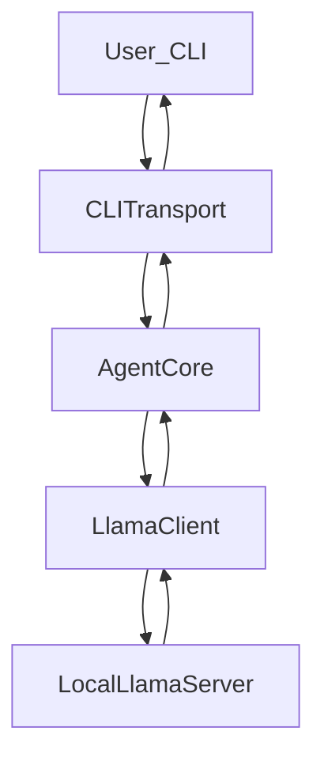

# Go 本地 llama-server Markdown Agent 设计与实现计划

## 总体架构

- **核心目标**: 实现一个最小可运行的 Agent：
  - 使用 **本地 llama-server** 作为大模型推理后端。
  - 使用 **Markdown 串** 管理系统指令与对话历史，不在对外协议中使用 JSON。
  - 当前形态为 **命令行交互（stdin/stdout）**，后续易扩展为 **HTTP webhook** 与 **飞书 WebSocket SDK**。
- **分层设计**（保持极简、可扩展）：
  - `LlamaClient`: 封装与本地 llama-server 的 HTTP 通信（内部可以用 JSON）。
  - `AgentCore`: 用 Markdown 管理系统指令和对话历史，对外提供 `Handle(input string) (markdownReply string, err error)`。
  - `CLITransport`: 命令行读写层，读一行用户输入，调用 `AgentCore`，打印 Markdown 回复。
  - 后续可添加 `HTTPTransport` / `FeishuWSTransport`，复用同一个 `AgentCore`。




## Markdown 对话与 Prompt 规范

- **系统指令区**（单独一段，固定在前）：
  - 内容示例："你是一个命令行 Agent，只输出 Markdown。"
  - 结构：

```md
    # System
    你是一个命令行 Agent，只输出 Markdown。
    

```

- **对话历史区**（按轮次累积）：
  - 每一轮用户与助手使用二级标题分块：

```md
    # Conversation
    ## user
    第一轮用户输入...

    ## assistant
    第一轮回复...

    ## user
    第二轮用户输入...

    ## assistant
    第二轮回复...
    

```

- 新一轮对话时，将最新 `## user` 段追加，并构造完整 prompt：
  - `SystemPrompt + "\n" + History + "\n\n请以 Markdown 形式回复本轮 assistant 的内容。"`
- **大模型输出约定**：
  - Llama 直接输出 Markdown 正文（不强制包含 `## assistant` 标题），
  - `AgentCore` 在内部将其包装为：

```md
    ## assistant
    <模型返回的 Markdown 正文>
    

```

- 并追加到 `History` 中。

## LlamaClient 设计

- **职责**: 只负责与本地 llama-server 通信，对上层屏蔽 HTTP 和 JSON 细节。
- **接口**：
  - `Complete(promptMarkdown string) (string, error)`
- **实现要点**：
  - 从配置或常量中读取：
    - `Endpoint`（如 `http://localhost:8080/v1/chat/completions`）。
    - `Model` 名称（如 `llama3`，可配置）。
  - 将传入的 Markdown prompt 组装成 llama-server 兼容的请求体：
    - 如采用 OpenAI 兼容接口：
      - `model`: 使用配置值。
      - `messages`: 仅包含一个 `{"role":"user","content": promptMarkdown}`，或未来扩展多条。
  - 使用 `net/http` 发送 POST 请求，设置 `Content-Type: application/json`。
  - 解析响应体，抽取第一条 `choices[0].message.content` 作为模型回复。
  - 处理错误场景：
    - HTTP 非 200 状态码时，读取 body 作为错误信息返回。
    - JSON 解析失败、无 choices 时返回清晰错误。

## AgentCore 设计

- **职责**: 管理对话 Markdown 状态，拼接 prompt，调用 LlamaClient，并维护历史。
- **状态字段**：
  - `SystemPrompt string`：系统提示 Markdown。
  - `History string`：对话历史 Markdown，从 `# Conversation` 开始。
  - `Llama *LlamaClient`：模型客户端。
- **构造函数**：
  - `NewAgentCore(llama *LlamaClient) *AgentCore`：
    - 初始化 `SystemPrompt` 为固定 Markdown 文本。
    - 初始化 `History` 为 `"# Conversation\n"`。
- **核心方法**：
  - `Handle(userInput string) (string, error)`：
    1. Trim 用户输入，判空（空则返回错误或忽略）。
    2. 将用户输入按 Markdown 段落追加到 `History`：
      - `History += "\n## user\n" + userInput + "\n"`。
    3. 拼接完整 prompt：
      - `fullPrompt := SystemPrompt + "\n" + History + "\n\n请以 Markdown 形式回复本轮 assistant 的内容。"`。
    4. 调用 `Llama.Complete(fullPrompt)` 获取回复 Markdown 正文。
    5. 将回复包装并追加至 `History`：
      - `History += "\n## assistant\n" + reply + "\n"`。
    6. 返回本轮回复正文给调用方（用于 CLI 打印）。
- **扩展点预留**：
  - 将来可以在 `AgentCore` 内部引入：
    - 工具调用（例如检测用户输入中是否包含特定命令，再调用本地工具）。
    - 上下文裁剪（控制 Markdown 长度，避免 prompt 过长）。

## CLITransport 设计

- **职责**: 将命令行作为当前唯一交互方式，挂在 AgentCore 之上。
- **行为**：
  - 程序启动时：
    - 初始化 `LlamaClient` 与 `AgentCore`。
    - 打印欢迎信息和简单帮助（如 `/exit` 退出）。
  - 主循环：
    1. 打印提示符 `>` 。
    2. 用 `bufio.Scanner` 从 `os.Stdin` 读取一行用户输入。
    3. 若读到 EOF 或扫描错误，则退出循环。
    4. 若输入为 `/exit`，友好打印一行退出信息后结束程序。
    5. 若输入为空行，跳过本轮。
    6. 将用户输入传给 `agent.Handle(line)`。
    7. 若返回错误，打印 `错误: xxx` 到标准输出。
    8. 若成功，打印模型返回的 Markdown（可在前后加空行提高可读性）。

## 配置与错误处理

- **配置方式**：
  - 初期可将 `Endpoint`、`Model` 直接写常量。
  - 预留使用环境变量读取的逻辑，例如：
    - `LLAMA_SERVER_ENDPOINT`、`LLAMA_MODEL`。
- **错误处理策略**：
  - llama-server 请求失败：
    - 打印简短错误信息给用户（中文说明 + 后端返回详情）。
  - 命令行读取错误：
    - 在主循环结束后打印错误并退出。
  - 输入为空：
    - 简单忽略本轮或提示“请输入内容”。

## 未来扩展点（HTTP webhook & 飞书 WebSocket）

- **HTTP webhook**：
  - 新增 `HTTPTransport` 层：
    - 使用 `net/http` 提供 `POST /webhook`。
    - 从请求体中解析用户文本（例如纯文本或简单 JSON 包装）。
    - 调用 `agent.Handle` 获取 Markdown 回复。
    - 将 Markdown 原样写入 HTTP 响应体（可加上 `Content-Type: text/markdown`）。
- **飞书 WebSocket SDK**：
  - 在飞书 SDK 的消息回调中：
    - 抽取用户发送的文本内容。
    - 调用 `agent.Handle` 获取 Markdown 回复。
    - 使用 SDK API 将 Markdown 回复发送回对应会话。
  - 保持 `AgentCore` 与 `LlamaClient` 完全不感知平台差异，只关注文本到文本的转换。

## 实现顺序建议

- **步骤 1**：搭建最小项目结构（单文件也可，但建议预留包结构）：
  - 初版本可全部写在 `main.go` 内，验证逻辑正确性。
- **步骤 2**：先实现 `LlamaClient.Complete` 的假实现（返回固定文本），跑通 CLI 流程。
- **步骤 3**：接入真实 `llama-server` HTTP 接口，调通一次完整对话。
- **步骤 4**：验证 Markdown 历史管理是否符合预期（可在调试时打印 `History`）。
- **步骤 5**：抽取 `LlamaClient`、`AgentCore` 到独立文件/包，保留 `main.go` 只做 CLITransport。
- **步骤 6**：视需求添加环境变量配置、基础日志输出与错误信息优化。

