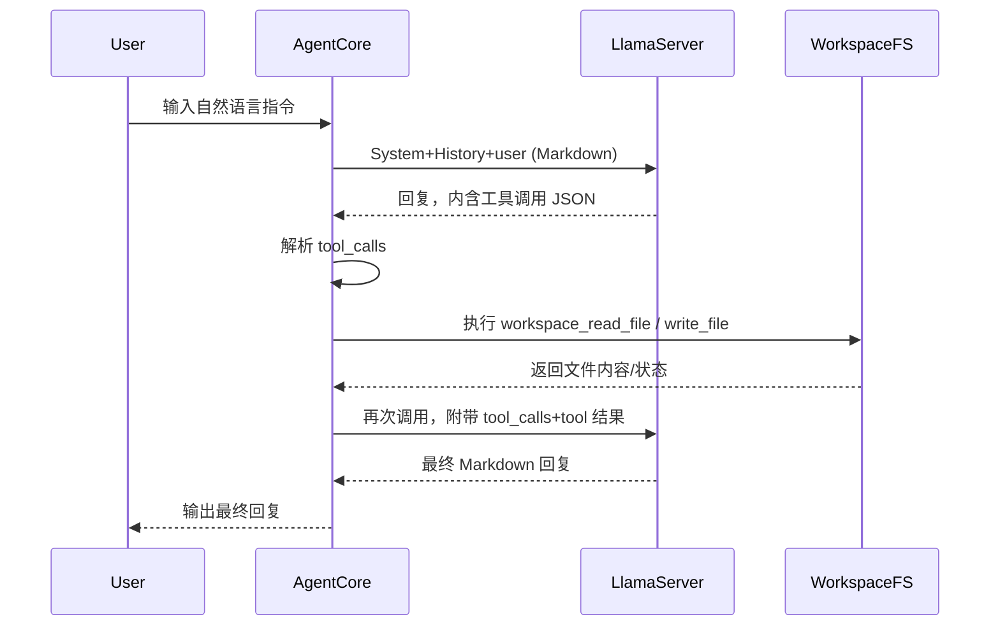

## 目标

- **对齐协议**：把当前在 `AGENT.md` 中描述的基于 `[FS_READ]` / `[FS_WRITE]` 的简易文件系统协议，升级为符合 OpenAI function tools 语义和结构的协议（如 `tools`, `tool_calls`, `tool_name`, `arguments` 等）。
- **落地实现**：在 `main.go` 中引入对工具调用结果的解析和执行逻辑，实现至少一个 `filesystem` 工具（读/写），同时保持向本地 `llama-server` 的兼容。
- **可扩展性**：协议层和实现层都为未来添加更多工具（如 shell、HTTP 请求等）预留接口，避免后续大改。

## 现状梳理

- **核心结构**：
  - `LlamaClient` 封装对本地 `llama-server` 的 `/v1/chat/completions` 调用，使用简单的 `messages` 列表（只发一个 `user` 内容，即我们拼好的 Markdown）。
  - `AgentCore` 只负责构造 Markdown system + history，并把用户每轮输入追加到 `History` 后发送，不理解工具调用，也不做任何结构化解析。
  - `WorkspaceFS` 已实现 `Read/Write/Append`，目前仅被 `AgentCore` 用于写 `MEMORY.md`，协议层对模型暴露的是 `[FS_READ]` 这类标记。
- **协议位置**：现有协议通过 `defaultAgent` 常量写在 `main.go` 中，被初始化为 `AGENT.md` 的默认内容。

## 设计思路（对齐 OpenAI function tools）

- **工具描述（静态 schema）**：
  - 在 Go 侧定义一个 `Tool`/`ToolSpec` 结构，类似：
    - `Name`：如 `workspace_read_file`, `workspace_write_file`。
    - `Description`：中文说明，方便写入 system prompt。
    - `ParametersJSONSchema`：用 JSON Schema（或简化版）描述参数，至少包括 `path` 等字段。
  - 这些描述不会真的传到 `llama-server` 的 API（因为当前服务端接口未必完全兼容 OpenAI tools 字段），而是把它们渲染进系统提示里，以自然语言+结构化示例的方式训练模型按 OpenAI tools 习惯输出。
- **调用约定（model 输出格式）**：
  - 约定模型在需要调用工具时输出一个 JSON 片段（或 Markdown 代码块），形如 OpenAI 的 `tool_calls`：

```json
{
  "tool_calls": [
    {
      "id": "call_1",
      "type": "function",
      "function": {
        "name": "workspace_read_file",
        "arguments": {
          "path": "AGENT.md"
        }
      }
    }
  ]
}
```

- 或者采用更简化但语义一致的格式，例如只允许一次调用时的：

```json
{
  "tool": "workspace_read_file",
  "arguments": { "path": "AGENT.md" }
}
```

- 在 `AGENT.md` 的 system prompt 中清晰规定：
  - 工具调用请放在单独的 JSON 代码块内（`

```json ...

``` `），且必须是合法 JSON。
    - 如果不需要调用工具，则正常用 Markdown 回复。

- **宿主执行策略**：
  - 在一轮对话中：
    1. 先调用 `llama.Complete(fullPrompt)` 得到回复字符串。
    2. 尝试从回复中解析是否存在合法的工具调用 JSON（优先找 ` 

```json` 代码块，退化为全串 JSON）。
    3. 如果存在工具调用：
       - 根据 `tool_name` 或 `function.name` 路由到本地实现（如 `WorkspaceFS.Read/Write`）。
       - 执行并得到结果（成功/失败、读出的内容等）。
       - 把工具调用和结果（以 OpenAI `tool` role/消息语义）序列化追加进 `History`，例如：
         - 一条 `assistant` 消息包含 `tool_calls`（可在 Markdown 中用注释或约定表示）。
         - 一条或多条 `tool` 消息，内容为工具输出。
       - 再次调用 `llama.Complete`，让模型基于工具结果给出最终 Markdown 回复（这一步就是典型的 tools 二段式调用流程）。
    4. 如果不存在工具调用，则直接将原始回复视为最终回复。

- **兼容性考量**：
  - 不改动现有 `chatRequest` / `chatMessage` 结构，继续通过单一 `user` 消息传入系统提示与历史，工具相关内容只存在于 Markdown/文本历史中。
  - 将来如果切换到完全兼容 OpenAI tools 的服务端（支持 `tools`、`tool_choice`、`tool_calls` 等字段），可以将现有工具执行逻辑迁移为真正的 JSON-level tools 调用，而不动协议文案。

## 具体改造步骤

- **步骤 1：抽象工具数据结构**
  - 在 `main.go` 中（或拆出新文件，后续实现时具体决定）定义：
    - `type Tool struct { Name string; Description string; JSONSchema string }`。
    - 一个 `tools` 列表，至少包含：
      - `workspace_read_file(path)`：读取 workspace 相对路径文件，返回文本内容。
      - `workspace_write_file(path, content)`：覆盖写入文本内容。
  - 为每个工具写出简明 JSON Schema 字符串，用于生成 system prompt。

- **步骤 2：重写默认 AGENT 协议文案**
  - 更新 `defaultAgent`，取消原有 `[FS_READ]` / `[FS_WRITE]` 标记说明。
  - 新增：
    - 用自然语言解释：你有一组工具，格式遵循 OpenAI function tools 风格。
    - 列出每个工具的名称、功能、参数结构（引用上一步的 JSON Schema 或给出字段表）。
    - 约定工具调用输出格式（单 JSON 或包含 `tool_calls` 数组），要求使用 ` 

```json` 代码块，示例 1~2 个典型调用。
    - 约定工具调用后的行为：
      - 模型只负责提出调用意图；工具执行结果会通过系统自动追加的 `tool` 消息反馈给你；之后你再用 Markdown 正式回答。

- **步骤 3：在 AgentCore 中加入工具执行管线**
  - 扩展 `AgentCore` 结构：
    - 增加 `Tools []Tool` 字段。
  - 修改 `NewAgentCore`：
    - 允许注入工具列表；如果未传入则使用默认文件系统工具。
  - 重构 `Handle` 流程：
    1. 将当前逻辑拆成：`callModelOnce(prompt string) (reply string, err error)` 的小函数。
    2. 第一轮调用：
       - 行为与当前相同，只是多传一个内部标志说明“这是 assistant 第一次回复”。
    3. 分析第一次回复：
       - 解析是否包含工具调用 JSON（解析失败视为无工具调用）。
       - 如果有：
         - 使用 `dispatchTools(calls []ToolCall) ([]ToolResult, error)` 执行所有调用。
         - 把调用和结果注入 `History`（使用约定好的 Markdown 模板，模拟 OpenAI 的 `assistant(tool_calls)` + `tool` 消息顺序）。
         - 构造第二次 `fullPrompt` 并再次调用 `callModelOnce`，得到最终自然语言回复。
    4. 最终：
       - 把最终的 Markdown 回复追加到 `History` 和 `MEMORY.md`。

- **步骤 4：实现工具调用的解析与调度**
  - 定义 Go 结构体表示工具调用与返回：
    - `ToolCall`：`ID`, `Name`, `Arguments`（`json.RawMessage` 或 `map[string]any`）。
    - `ToolResult`：`CallID`, `Content`（文本化结果），`Error` 等。
  - 解析逻辑：
    - 编写 `extractToolCalls(text string) ([]ToolCall, restText string, error)`：
      - 优先查找第一个 ` 

```json` 代码块。
      - 尝试将其中内容反序列化为：
        - 完整结构 `{ "tool_calls": [...] }`；
        - 或简化结构 `{ "tool": "name", "arguments": {...} }`。
      - 将解析出的调用转为统一的 `[]ToolCall`，并返回去掉代码块后的剩余自然语言文本（作为 assistant “说明性内容”，可选择记录在历史中）。
  - 调度逻辑：
    - 使用一个 `map[string]func(args json.RawMessage) (string, error)` 注册每个工具的执行函数：
      - `workspace_read_file` → 调 `WorkspaceFS.Read`；
      - `workspace_write_file` → 调 `WorkspaceFS.Write`。
    - 对每个 `ToolCall`：
      - 检查工具是否存在；不存在则返回错误字符串（写入 `ToolResult.Content`）。
      - 解析参数（反序列化到具体结构体），调用对应实现。
      - 将结果打包为 `ToolResult`。

- **步骤 5：把工具调用和结果写回对话历史**
  - 设计一个简单的 Markdown 表示法，模拟 OpenAI 的多轮消息：

```markdown
## assistant (tool_calls)
```json
{
  "tool_calls": [ ... ]
}
```

## tool workspace_read_file

(这里是文件内容或错误信息)

```

  - 在 `AgentCore.History` 中按上述格式追加，确保下一轮 prompt 能让模型“看到”自己的工具调用与结果。
  - 注意保持与现有 `## user` / `## assistant` 样式一致，保证 prompt 可读性。

- **步骤 6：更新 CLI 文案/说明**
  - 在命令行启动说明中，增加对“工具调用”的一句描述，让使用者知道：
    - Agent 现在会自动按 OpenAI function tools 风格调用文件系统工具。
    - 他们不需要手写 `[FS_READ]` 标签。

- **步骤 7：预留未来工具扩展点**
  - 在 `Tool` 定义和调度 map 中，设计为可以轻松注册新工具：
    - 例如只需增加一个 `Tool` 条目 + 一个执行函数注册，即可新增 `run_shell_command` 或 `http_request`。
  - 在 `AGENT.md` 的系统提示中：
    - 把“当前可用工具”列表与“未来可能添加的工具”说明分开，避免模型幻想不存在的工具。

## 简要时序示意（工具调用一轮）



## TODO 列表

- **define-tools-structs**：在 Go 侧定义 `Tool` / `ToolCall` / `ToolResult` 等结构及工具注册表。
- **agent-prompt-update**：重写 `defaultAgent`，描述新的 OpenAI function tools 风格协议和工具列表，移除旧的 `[FS_READ]` / `[FS_WRITE]` 协议。
- **agent-handle-refactor**：重构 `AgentCore.Handle` 为“首次模型调用 → 解析工具调用 → 执行 → 二次调用”的两段式流程。
- **tool-call-parser**：实现从模型回复文本中抽取/解析工具调用 JSON 的逻辑，支持标准 `tool_calls` 和简化格式。
- **filesystem-tools-impl**：用现有 `WorkspaceFS` 实现 `workspace_read_file` / `workspace_write_file`，并与调度器集成。
- **history-formatting**：设计并实现在 Markdown 历史中记录 `assistant(tool_calls)` 与 `tool` 结果的格式。
- **cli-doc-update**：更新命令行启动提示和（如有）文档，描述新的工具协议和使用方式。

