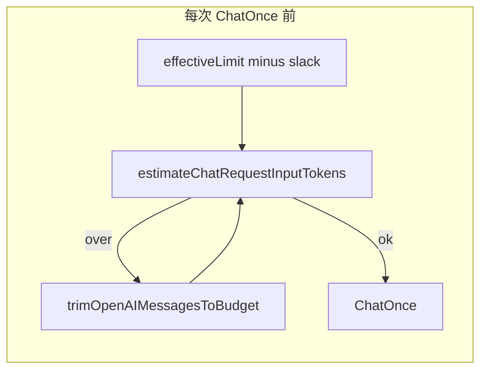

# 硬不超限上下文预算实施方案

## 目标与预算定义

- **输入预算**（与现有 [`agent_core.go`](d:\cursor-project\coral\src\agent_core.go) 一致）：`effectiveLimit = MaxContextTokens - MaxOutputTokens`（当两者均为正且 `MaxContextTokens > MaxOutputTokens`），否则为 `MaxContextTokens`。
- **硬约束对象**：每次调用 [`OpenAIClient.ChatOnce`](d:\cursor-project\coral\src\openai_client.go) 前，使用已有 [`estimateChatRequestInputTokens(messages, tools)`](d:\cursor-project\coral\src\tokens.go) 的 **msgTok + toolTok** 与 **`effectiveLimit - slack`** 比较；循环直到满足（`slack` 为固定保守余量，建议默认 256～512 或 `min(512, effectiveLimit/10)`，可选环境变量如 `AGENT_CONTEXT_TOKEN_SLACK`）。
- **原因**：裁剪侧当前用 `estimateTokensSimple`（`role+":"+content` + vision 常数），与真实请求 JSON（多模态 parts、tool 定义）口径不一致；**以 `estimateChatRequestInputTokens` 为唯一判据**才能与日志/pre 阶段一致，再用 `slack` 吸收偏差。适配目标见下文「风险说明」：以 **Qwen3.5 + llama.cpp** 为主，而非泛化所有云端模型。

## 1. OpenAI 消息数组：可安全裁剪的 `trimOpenAIMessagesToBudget`

**新增**（建议放在 [`tokens.go`](d:\cursor-project\coral\src\tokens.go) 或新文件 `context_trim.go`）：`trimOpenAIMessagesToBudget(messages, tools, limit int, headKeep, tailKeep int) []openai.ChatCompletionMessageParamUnion`。

- **`headKeep`**：从切片开头保留的条数（不可删）。由 [`HandleWithSessionWithMedia`](d:\cursor-project\coral\src\agent_core.go) 在 `simpleMsgsToOpenAI` 之后设为：前导 **system（若有）+ user profile（若有）** 对应的消息数（与当前构造顺序一致：先 system，再 profile user，再历史…）。
- **`tailKeep`**：从切片末尾保留的条数（不可删）。初始为 **1**（当前轮 user）；每轮工具后 += **1（assistant + tool_calls）+ N（tool 条数）**——这要求先把「带 `tool_calls` 的 assistant」写入 `messages`（见下文缺口）。
- **删除策略**：仅在 `messages[headKeep : len-tailKeep]` 内，从**左到右**删除**完整语义段**，保证 OpenAI 约束：
  - 若删除 assistant 且其含 `tool_calls`，必须**同批删除**紧随其后的对应 `tool` 消息（按 `call_id` 分组，与现有 [`classifyChatMessageRole`](d:\cursor-project\coral\src\tokens.go) / union 判别一致）。
  - 不允许在段中间撕开 `tool_calls` 与 `tool` 的绑定。
- **循环**：`for estimateChatRequestInputTokens(messages, tools) > limit && len(removable) > 0` 删一段；若删无可删仍超限，进入 **2b 工具内容截断**（见下）。

**2b（同函数内或子步骤）**：在「已无法删段」仍超限时，对 **removable 区域内**的 `tool` / `user` / `assistant` 纯文本 content 做 **从长到短** 的截断（带固定后缀说明如「…(truncated)」），用 rune/字符安全截断；对 **vision** 的 `image_url` 数据 URL：若仍超限，可去掉非尾条中的图片 part 或整段降级为文本说明（尾条由 `tailKeep` 保护，通常含当前图）。

## 2. 修复工具轮次消息链（与裁剪前提强相关）

当前循环在 tool 分支只 `append(ToolMessage)`，未把 **含 `tool_calls` 的 assistant** 追加进 `messages`（[`agent_core.go` 206-218 行附近](d:\cursor-project\coral\src\agent_core.go)）。标准 Chat Completions 语义下，下一轮请求应在 tool 消息之前包含该 assistant；否则后端行为未定义，裁剪也无法识别「assistant+tools」段。

- **做法**：在 `dispatchToolsOpenAI` 之后，先将 `choice.Message` 转为 `openai.ChatCompletionMessageParamUnion`（assistant + `tool_calls`），再依次 append `ToolMessage`。**然后**更新 `tailKeep` 并调用 `trimOpenAIMessagesToBudget`。
- **在每次 `ChatOnce` 前**（含 `toolRound == 0`）都执行一次裁剪，使「历史 + 当前轮 + 已累计的工具上下文」始终 ≤ 预算。

## 3. `reduceHistory` / `ensureContextWithinLimitSimple`：保证相对 `SimpleMsg` 预算不越界

文件：[`tokens.go`](d:\cursor-project\coral\src\tokens.go)。

| 现状问题 | 处理 |
| -------- | ---- |
| `len(prefix)==0` 仍超限时直接 `return cur` | 对 **tail** 的文本做 **硬截断**（保留末尾优先保留「用户问题」可用从后向前保留策略或按比例截断），`ImageCount>0` 时在仍超限时降为 0 并在文本中注明图片已省略（避免高估仍爆） |
| 固定 4 层后仍可能超 | 改为 **`for` 直到 `estimateTokensSimple <= windowLimit` 或无法继续**，并设 **最大迭代次数**（如 32）防止死循环；无法继续则走 tail 截断 |
| `summarizeSimpleChunkWithLLM` 输入过大 | 在拼 `historyText` 前按 **字符/估算 token** 上限截断每条消息内容，或对 chunk 再二分切片 |

- **`ensureContextWithinLimitSimple`**：`reduceHistory` 失败时**不再**无条件回退全文（当前 [`tokens.go` 147-150 行](d:\cursor-project\coral\src\tokens.go)）；改为 **保守截断**：保留 tail + 尽量保留 system 头，中间按条删除或截断至 `estimateTokensSimple <= maxTokens`。现有测试 [`TestEnsureContextWithinLimitSimple_onReduceError_returnsOriginal`](d:\cursor-project\coral\src\tokens_test.go) 需改为期望「不超限」行为。

> 说明：`SimpleMsg` 阶段仍可用 `estimateTokensSimple` 控制「进入 `simpleMsgsToOpenAI` 前」的规模；**最终硬门**仍以第 1 节的 `estimateChatRequestInputTokens` + slack 为准。

## 4. 会话摘要子请求：[`session.go`](d:\cursor-project\coral\src\session.go) `summarizeMessagesWithLLM`

- 在调用 `ChatOnce` 前，对 `expired` 集合：若拼接后的估算已超过 **摘要专用预算**（例如 `agent.MaxContextTokens - 摘要 max_out - slack`，或单独 `min(8000, effectiveLimit)`），则：
  - **分块**：将 `msgs` 按 `estimateTokensSimple`（或字符）切成多块，每块单独摘要，再对「多块摘要」做一次合并摘要（合并仍超则继续截断/分层），避免摘要 RPC 自身爆上下文。
- 与 `compactActiveMessages` 行为一致：失败时可仍跳过摘要，但**不应**向主对话注入未截断的巨大文本（当前路径主要是 LLM 输入风险）。

## 5. 测试与回归

- **新测**：`trimOpenAIMessagesToBudget` — 构造超长历史 + 短尾 user，`estimateChatRequestInputTokens` 必须 ≤ limit。
- **新测**：工具多轮 — stub 返回 `tool_calls`，验证 `messages` 含 assistant+tools 且多轮后仍 ≤ limit（可配合极大 `tool` content）。
- **改测**：`TestReduceHistory_pinsLastMessage` 类场景下，尾条极长时 **必须截断** 且 token ≤ 上限。
- **改测**：`TestEnsureContextWithinLimitSimple_onReduceError_returnsOriginal` 改为断言截断后不超限。

## 关键文件

- [`d:\cursor-project\coral\src\agent_core.go`](d:\cursor-project\coral\src\agent_core.go) — 工具链 assistant 追加、`headKeep`/`tailKeep`、每轮 `ChatOnce` 前裁剪。
- [`d:\cursor-project\coral\src\tokens.go`](d:\cursor-project\coral\src\tokens.go) — `trimOpenAIMessagesToBudget`（或新文件）、`reduceHistory`/tail 截断/失败回退、`summarizeSimpleChunkWithLLM` 输入 cap。
- [`d:\cursor-project\coral\src\session.go`](d:\cursor-project\coral\src\session.go) — `summarizeMessagesWithLLM` 分块与合并。
- [`d:\cursor-project\coral\.env.template`](d:\cursor-project\coral\.env.template) — 文档化 `AGENT_CONTEXT_TOKEN_SLACK`（若实现）。

## 风险说明（诚实边界）— 仅针对 Qwen3.5 + llama.cpp

本仓库默认对接 **llama.cpp** 提供的 OpenAI 兼容 `/v1/chat/completions`（如 `LLAMA_SERVER_ENDPOINT` / `OPENAI_BASE_URL`），模型以 **Qwen3.5**（GGUF）为主。以下边界均在该前提下陈述，不要求覆盖其它厂商 API 的计费口径。

- **Tokenizer 偏差**：进程内仍用 `tiktoken`（cl100k）对 **请求 JSON 序列化结果** 做估算；**llama.cpp 实际喂给 Qwen 的是 GGUF 词表**，与 cl100k 在「逐 token」上不会完全一致。**slack** 的首要用途是吸收 **Qwen+llama.cpp** 路径上的估算误差，而不是对齐 OpenAI 官方账单。
- **硬保证的含义**：保证在「同一套估算 + slack + 裁剪」下，**发往 llama-server 的请求**在本地度量下不超过 `effectiveLimit`；不承诺与 OpenAI 云端或其它后端的 token 数逐字一致。若实测某 GGUF / 某版本仍偏紧或偏松，优先调 `AGENT_CONTEXT_TOKEN_SLACK` 或 `AGENT_VISION_TOKENS_PER_IMAGE`；若将来需要更贴 llama.cpp，可再评估接入与 **Qwen GGUF 同词表** 的本地计数（可选增强，非本阶段必做）。
- **Vision**：多模态 token 仍以服务端/模型为准；实现上继续用 **每图常数** + slack 做保守上限，与当前 [`user_media.go`](d:\cursor-project\coral\src\user_media.go) 策略一致，并针对 **单后端（llama.cpp）** 调参即可。
